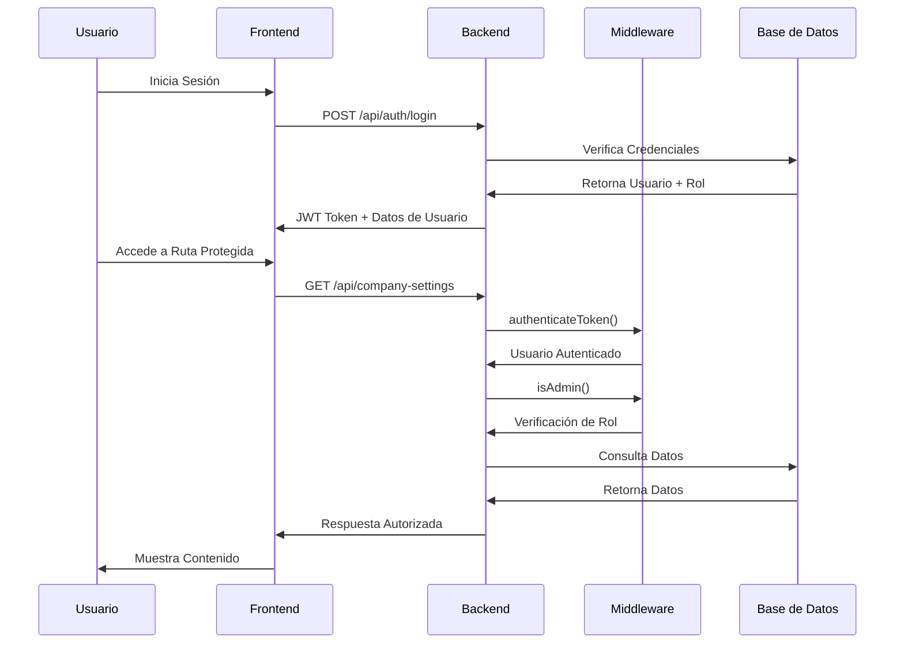

# Arquitectura del Sistema AutoTaller Pro

## Diagrama de Arquitectura

```mermaid
graph TB
    subgraph "Frontend (React + TypeScript)"
        A[Login/Auth] --> B[Dashboard]
        B --> C[Órdenes de Servicio]
        B --> D[Gestión de Clientes]
        B --> E[Gestión de Vehículos]
        B --> F[Inventario]
        B --> G[Facturación]
        B --> H[Configuración]
        B --> I[Reportes Avanzados]
        
        style A fill:#e1f5fe
        style B fill:#e1f5fe
        style I fill:#c8e6c9
    end
    
    subgraph "Backend (Node.js + Express)"
        J[API Routes] --> K[Middleware de Auth]
        K --> L[Middleware de Roles]
        L --> M[Controllers]
        M --> N[Storage Layer]
        
        style L fill:#c8e6c9
        style M fill:#e1f5fe
    end
    
    subgraph "Base de Datos (PostgreSQL)"
        O[Users & Roles]
        P[Clientes & Vehículos]
        Q[Órdenes de Servicio]
        R[Inventario]
        S[Facturación]
        T[Configuración]
        
        style O fill:#c8e6c9
        style T fill:#c8e6c9
    end
    
    subgraph "Middleware de Autorización"
        U[authenticateToken] --> V[isAdmin]
        U --> W[isSuperAdmin]
        U --> X[isOperatorOrHigher]
        U --> Y[canAccessResource]
        
        style V fill:#c8e6c9
        style W fill:#c8e6c9
        style X fill:#c8e6c9
        style Y fill:#c8e6c9
    end
    
    subgraph "Rutas Protegidas"
        Z[/api/company-settings] --> AA[Admin Only]
        BB[/api/invoices] --> AA
        CC[/api/workers] --> AA
        DD[/api/reports/*] --> AA
        
        style AA fill:#c8e6c9
    end
    
    subgraph "Funcionalidades por Rol"
        EE[Super Admin] --> FF[Acceso Total]
        GG[Admin] --> HH[Gestión + Reportes]
        II[Operator] --> JJ[Órdenes + Inventario]
        KK[User] --> LL[Consulta Personal]
        
        style EE fill:#c8e6c9
        style GG fill:#c8e6c9
        style II fill:#e1f5fe
        style KK fill:#e1f5fe
    end
    
    B --> J
    N --> O
    N --> P
    N --> Q
    N --> R
    N --> S
    N --> T
```

## Estado de Implementación

### ✅ Implementado (Verde)
- **Sistema de Autenticación JWT**
- **Middleware de Autorización por Roles**
- **Protección de Rutas Sensibles**
- **Dashboard Básico para Todos los Roles**
- **Dashboard Avanzado para Administradores**
- **Sistema de Roles (superAdmin, admin, operator, user)**
- **Rutas de Reportes Avanzados**
- **Filtrado de Menú por Rol**

### 🔴 Pendiente (Rojo)
- **Implementación de Métodos de Storage para Reportes**
- **Gráficos y Visualizaciones en Dashboard**
- **Exportación de Reportes a PDF/Excel**
- **Notificaciones Push en Tiempo Real**
- **Auditoría de Acciones de Usuario**
- **Backup Automático de Base de Datos**
- **Métricas de Rendimiento del Sistema**

## Flujo de Autorización



## Estructura de Archivos

```
autotaller-pro-completo/
├── client/                          # Frontend React
│   ├── src/
│   │   ├── components/
│   │   │   ├── AdminDashboard.tsx   # ✅ Dashboard Admin
│   │   │   ├── layout/
│   │   │   │   └── sidebar.tsx      # ✅ Filtrado por Rol
│   │   │   └── ...
│   │   └── pages/
│   │       └── dashboard.tsx        # ✅ Lógica de Roles
├── server/                          # Backend Express
│   ├── middleware/
│   │   ├── authMiddleware.ts        # ✅ Autorización
│   │   └── firstLoginMiddleware.ts  # ✅ Primera Sesión
│   ├── routes/
│   │   ├── reports.ts               # ✅ Reportes Avanzados
│   │   └── routes.ts                # ✅ Rutas Protegidas
│   └── ...
└── shared/
    └── schema.ts                    # ✅ Esquemas DB
```

## Seguridad Implementada

### Niveles de Acceso
1. **Super Admin**: Acceso total al sistema
2. **Admin**: Gestión completa + reportes avanzados
3. **Operator**: Gestión de órdenes e inventario
4. **User**: Consulta de información personal
5. **Guest**: Acceso público limitado

### Rutas Protegidas
- `/api/company-settings` → Solo Admin
- `/api/invoices` → Solo Admin
- `/api/workers` → Solo Admin
- `/api/reports/*` → Solo Admin
- `/api/dashboard/stats` → Todos los usuarios autenticados

### Middleware de Seguridad
- **authenticateToken**: Verifica JWT válido
- **isAdmin**: Verifica rol de administrador
- **isSuperAdmin**: Verifica rol de super administrador
- **isOperatorOrHigher**: Verifica rol de operario o superior
- **canAccessResource**: Control granular de recursos

## Próximos Pasos

1. **Implementar métodos de storage para reportes**
2. **Agregar gráficos con Chart.js o Recharts**
3. **Implementar exportación de reportes**
4. **Agregar métricas de rendimiento**
5. **Implementar auditoría de acciones**
6. **Optimizar consultas de base de datos**
